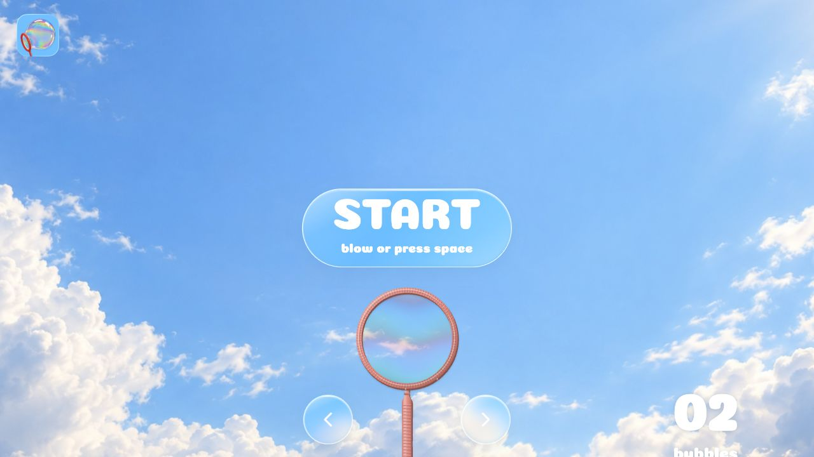

# Blow a Bubble

[Visit the live website on GitHub Pages](https://olliedesign00-dotcom.github.io/a-little-bubble-sky/)

[](https://olliedesign00-dotcom.github.io/a-little-bubble-sky/)

An interactive bubble-blowing website with microphone, keyboard, and touch controls. It features soap-film lettering, interchangeable bubble wands, and a slowly drifting photographic sky.

## How to play

- Select **START**, allow microphone access, and blow gently toward your device.
- Alternatively, hold **Space** or press and hold the wand. Release to let the bubble float away.
- Use the left and right arrows to change wands.
- Tap a floating bubble or an opening letter to pop it.
- The counter records bubbles released, including bubbles that have been popped.

Microphone audio is analyzed locally in your browser. Audio is not recorded or uploaded, and the camera is not used.

## Sound effects

Select **Sound on / Sound off** to toggle effects. The setting is saved on your device. Sound is enabled only after a pointer or keyboard interaction.

- `blow.mp3`: gentle breath during inflation, played more quietly in microphone mode to reduce feedback.
- `bubble-pop-s.mp3`, `bubble-pop-m.mp3`, `bubble-pop-l.mp3`: small, medium, and large bubble sounds, played when a breath releases a bubble and when a bubble is popped. A double-wand release plays one sound per breath.
- `bubble-pop-m.mp3` also plays when selecting START.
- `change.mp3`: switching wands.

Audio files are provided by the project owner and stored in `dist/assets/audio/`.

## Local development

The website uses plain HTML, CSS, and JavaScript. No packages or build step are required.

```sh
python3 -m http.server 4173 --directory dist
```

Open http://localhost:4173. Microphone access requires HTTPS or localhost.

## Deployment

Public website files are in `dist/`. The GitHub Actions workflow checks JavaScript syntax and deploys this directory to GitHub Pages when changes are pushed to `main`.

Keep changes local while reviewing them. Push only when the complete update is approved for publication.

## Motion and accessibility

The opening letters can be popped using a pointer or the Enter key. The Start button appears before the opening animation finishes. Reduced-motion preferences disable cloud movement and simplify popping effects.

## Credits

The layout is based on the project's Figma design. The Coiny font is distributed under the SIL Open Font License; see `dist/assets/OFL-Coiny.txt`.
